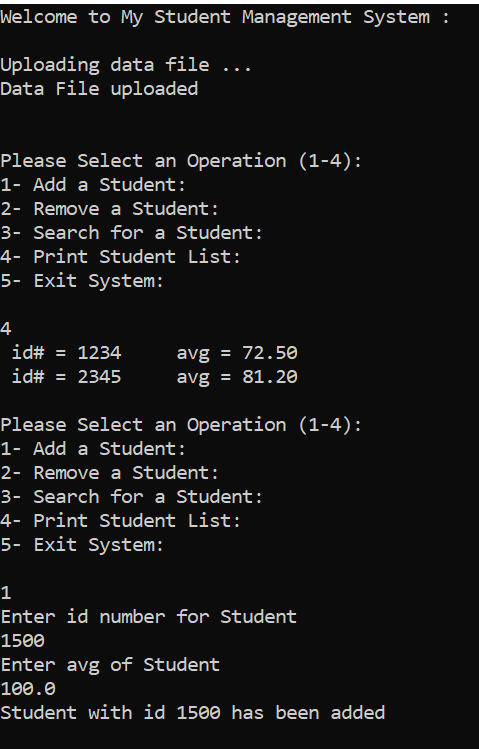
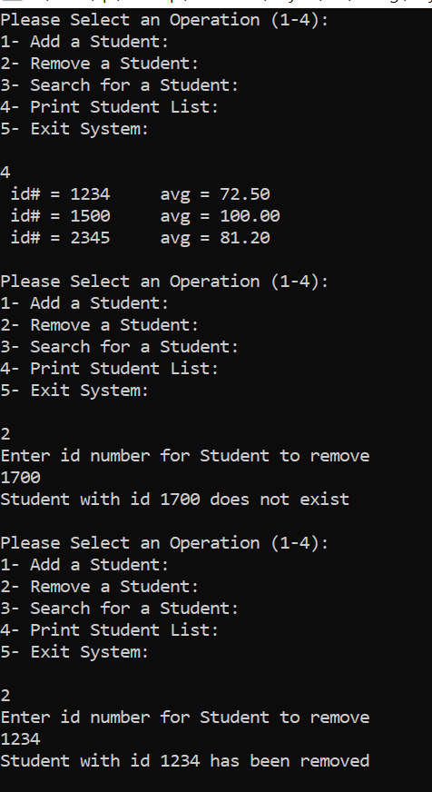
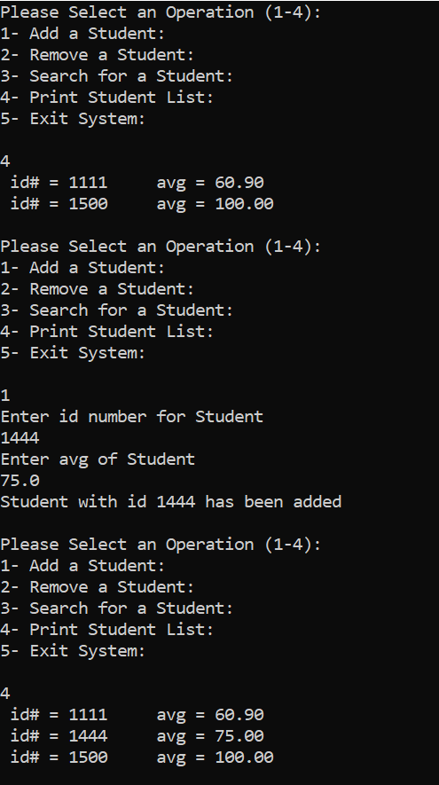
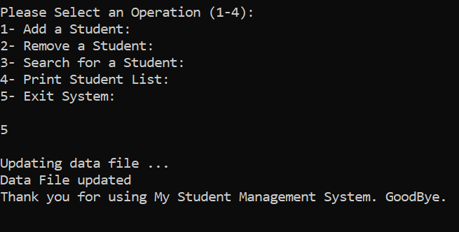

# 📚 Student Management System

A simple student management system implemented in C. This project allows you to add, remove, search for, and print students' information. It also includes functionality to upload and update data from a text file.

## 📑 Table of Contents
- [📚 Student Management System](#-student-management-system)
  - [📑 Table of Contents](#-table-of-contents)
  - [🌟 Overview](#-overview)
  - [✨ Features](#-features)
  - [⚙️ Technologies Used](#️-technologies-used)
  - [🏃‍♀️ How to Run](#️-how-to-run)
    - [Prerequisites](#prerequisites)
    - [Steps to Run](#steps-to-run)
    - [Notes](#notes)
  - [🖼 Screenshots](#-screenshots)
  - [📂 Files Included](#-files-included)
  - [🤝 Contact](#-contact)
    - [Thank you for checking out this project! 🚀](#thank-you-for-checking-out-this-project-)

## 🌟 Overview

This project is a basic implementation of a student management system. It uses an array to store student IDs and their corresponding average grades. The system provides the following functionalities:
- Add a new student.
- Remove an existing student.
- Search for a student by ID.
- Print the list of all students.
- Upload and update data from/to a text file (`students.txt`).

## ✨ Features

- **Add Student:** Adds a new student with an ID and average grade.
- **Remove Student:** Removes a student based on their ID.
- **Search Student:** Searches for a student by ID and displays their details.
- **Print Students:** Displays the list of all students with their IDs and average grades.
- **Upload Data:** Loads student data from a text file (`students.txt`).
- **Update Data:** Saves the current student data back to the text file (`students.txt`).
- **Exit System:** Exits the program gracefully.

## ⚙️ Technologies Used

- **Programming Language:** C
- **Tools:** Text Editor (e.g., VS Code), Compiler (e.g., GCC)
- **File Handling:** Reading from and writing to text files.

## 🏃‍♀️ How to Run

### Prerequisites
- Ensure you have a C compiler installed (e.g., GCC).
- Make sure the `students.txt` file is in the same directory as the source code.

### Steps to Run

1. **Compile the Program:**
   ```bash
   gcc assignment_no_1.c -o student_manager
   ```

2. **Run the Executable:**
   ```bash
   ./student_manager
   ```

3. **Using the System:**
   - The program will display a main menu with options.
   - Enter the corresponding number to perform the desired operation.
   - For example:
     - Press `1` to add a student.
     - Press `2` to remove a student.
     - Press `3` to search for a student.
     - Press `4` to print the list of students.
     - Press `5` to exit the system.

### Notes
- The program automatically uploads data from `students.txt` when it starts.
- Any changes made during the session are saved back to `students.txt` when exiting.

## 🖼 Screenshots

The following screenshots demonstrate the execution of the program:







## 📂 Files Included

- **`assignment_no_1.c`:** The source code of the student management system.
- **`student_manager.exe`:** The compiled executable file.
- **`students.txt`:** The text file containing student data.
- **Images (`1.png`, `2.png`, ..., `5.png`):** Screenshots demonstrating the program's execution.

## 🤝 Contact

If you have any questions or suggestions, feel free to reach out!

- **Email:** raghadmbuzia@gmail.com
- **LinkedIn:** [in/raghad-murad](http://linkedin.com/in/raghad-murad-02690433a)

---

### Thank you for checking out this project! 🚀